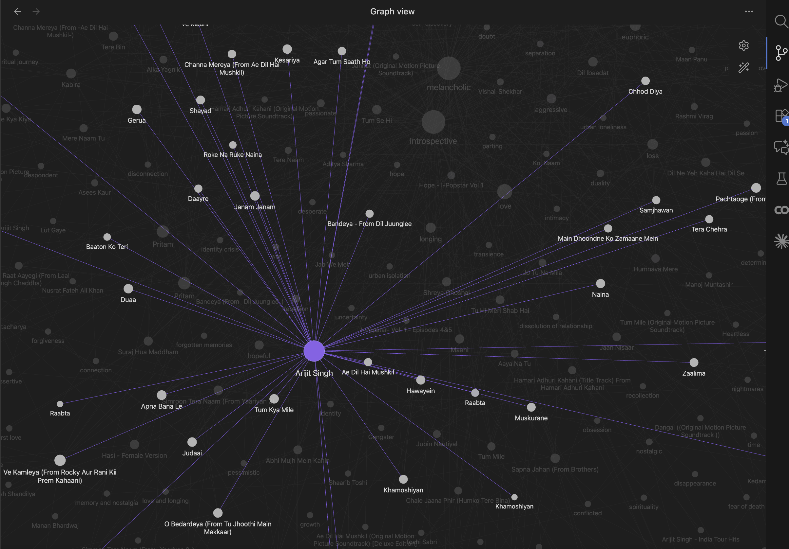
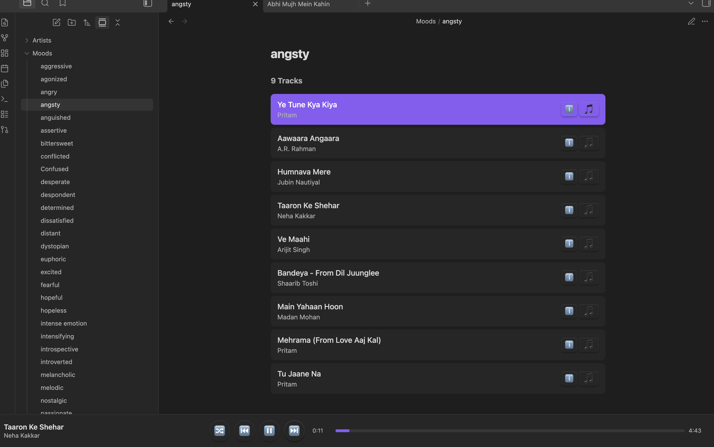

# Vectrola

🎧 **Multimodal Music Knowledge Graph**

Build a semantic search engine for your music library using AI. Query with natural language like *"melancholic songs about heartbreak"* or *"upbeat 80s synth"* instead of relying on rigid metadata tags. Vectrola combines lyrics, audio embeddings, and LLM-extracted themes to understand your music at a deeper level.

[](https://opensource.org/licenses/MIT)
[](https://www.python.org/downloads/)

## Features

- **Multi-Source Lyrics Fetching**: Fetch lyrics from LRClib (free, synced lyrics) and Genius, with Whisper transcription as fallback for obscure tracks
- **Semantic Analysis**: Extract themes, moods, and narrative using local LLMs (Ollama)
- **Hybrid Vector Search**: Find music by meaning using text embeddings (lyrics, moods, themes) and CLAP audio embeddings with RRF fusion
- **Acoustic Similarity**: Find songs that *sound* similar using CLAP audio embeddings
- **Interactive Obsidian Wiki**: Generate a browsable knowledge graph with Spotify-like audio player, wikilinks, and DataviewJS integration
- **Claude Code Integration**: MCP server with 5 tools for seamless AI assistant workflows

## Screenshots

### Obsidian Knowledge Graph View

Visualize your entire music library as an interactive network of artists, songs, moods, and themes:



*Navigate through connections between songs, artists, moods (like "melancholic", "hopeful"), and themes (like "longing", "identity crisis"). Each node is clickable and leads to detailed pages with lyrics, metadata, and an embedded audio player.*

### Mood-Based Playlist Browser

Browse your library by mood with an integrated audio player:



*Select any mood from the sidebar to see matching tracks. Click to play directly in Obsidian with the Spotify-like player bar at the bottom.*

## Quick Start

### Prerequisites

Before you begin, make sure you have:

1. **Python 3.10+** installed

2. **Ollama** running locally with a model (required for semantic analysis):
   ```bash
   ollama serve
   ollama pull qwen2.5:3b  # Recommended, or llama3.2:1b for faster/smaller
   ```

3. **Qdrant** vector database (required for search features only):
   ```bash
   docker run -d --name qdrant -p 6333:6333 qdrant/qdrant
   ```
   
   Note: You can analyze and ingest tracks without Qdrant. It's only needed for `vectrola search` and `vectrola similar` commands.

### Installation

```bash
# Clone the repository
git clone https://github.com/Arunes007/vectrola.git
cd vectrola

# Install with all features (recommended)
pip install -e ".[full]"

# Or install specific feature sets:
pip install -e ".[vectors]"   # + Vector search (Qdrant, embeddings)
pip install -e ".[audio]"      # + CLAP audio embeddings  
pip install -e ".[mcp]"        # + Claude Code MCP server
pip install -e ".[dev]"        # + Development tools (pytest, ruff)

# Or minimal install (just ingestion pipeline, no search)
pip install -e .
```

### API Keys Setup (Optional)

**All features work without API keys** using free services and local processing. API keys are only needed for specific use cases:

```bash
cp .env.example .env
# Edit .env and add your API keys (both optional):
```

- **Genius API** (optional): For lyrics of newer/obscure songs not in LRClib
  - Get at: https://genius.com/api-clients
  - Without it: Falls back to LRClib (free, no auth) → Whisper transcription
  
- **YouTube API** (optional): For future YouTube integration features
  - Get at: https://console.cloud.google.com/apis/credentials
  - Currently unused in core features

**Most users don't need any API keys** - LRClib provides excellent free lyrics coverage, and Whisper handles the rest.

### Usage

```bash
# Check system status
vectrola status

# Analyze a single file (preview, no changes)
vectrola analyze ~/Music/song.mp3

# Ingest files and write metadata to tags
vectrola ingest ~/Music/

# Search by vibe/mood
vectrola search "melancholic sad song"

# Find similar tracks
vectrola similar "Tum Hi Ho"

# Generate Obsidian wiki
vectrola wiki
```

## Documentation

- [Architecture Overview](docs/architecture.md)
- [Semantic Search Guide](docs/search.md)
- [Qdrant Vector Database](docs/qdrant.md)
- [Lyrics Fetching](docs/lyrics.md)
- [CLAP Audio Embeddings](docs/clap.md)
- [Obsidian Wiki with Audio Player](docs/wiki.md)
- [MCP Server for Claude Code](docs/mcp.md)
- [CLI Reference](docs/cli.md)
- [Testing Guide](docs/testing.md)

## Project Status

| Day | Feature | Status |
|-----|---------|--------|
| 1 | Transcription + LLM Synthesis | ✅ Complete |
| 2 | Vector Database (Qdrant) | ✅ Complete |
| 3 | Audio Embeddings (CLAP) | ✅ Complete |
| 4 | Wiki Generation (Obsidian) | ✅ Complete |
| 5 | Claude Code Integration (MCP) | ✅ Complete |
| 6 | Interactive Audio Player | ✅ Complete |
| 7 | Feature Completion & Polish | ⏳ In Progress |

## Contributing

We welcome contributions! Please see our [Contributing Guidelines](CONTRIBUTING.md) for details on:

- Setting up your development environment
- Running tests
- Code style guidelines
- Submitting pull requests

Check out our [open issues](https://github.com/Arunes007/vectrola/issues) for ideas on where to start.

## License

This project is licensed under the MIT License - see the [LICENSE](LICENSE) file for details.
