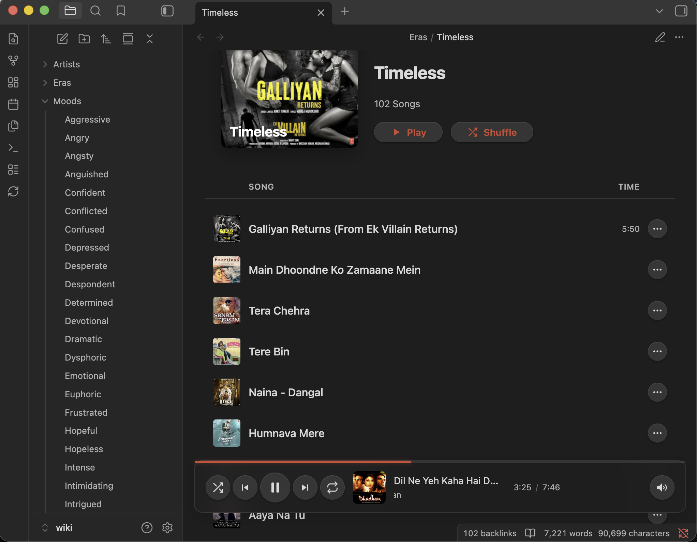

# Vectrola

🎧 **Multimodal Music Knowledge Graph**

Build a semantic search engine for your music library using AI. Query with natural language like *"melancholic songs about heartbreak"* or *"upbeat 80s synth"* instead of relying on rigid metadata tags. Vectrola combines lyrics, audio embeddings, and LLM-extracted themes to understand your music at a deeper level.

[](https://opensource.org/licenses/MIT)
[](https://www.python.org/downloads/)

## Features

- **Multi-Source Lyrics Fetching**: Fetch lyrics from LRClib (free, synced lyrics) and Genius, with Whisper transcription as fallback for obscure tracks
- **Semantic Analysis**: Extract themes, moods, and narrative using local LLMs (Ollama)
- **Hybrid Vector Search**: Find music by meaning using multilingual text embeddings (Hindi + English) and CLAP audio embeddings with RRF fusion
- **Acoustic Similarity**: Find songs that *sound* similar using CLAP audio embeddings
- **Google Drive Integration**: Ingest music directly from Google Drive - stream and play on any device without downloading
- **Anonymous by Default**: Works offline with no account; optionally login to sync your library across devices
- **Interactive Obsidian Wiki**: Generate a browsable knowledge graph with Spotify-like audio player, wikilinks, and DataviewJS integration
- **Claude Code Integration**: MCP server with 5 tools for seamless AI assistant workflows

## Screenshots

### Obsidian Knowledge Graph View

Visualize your entire music library as an interactive network of artists, songs, moods, and themes:


*Navigate through connections between songs, artists, moods (like "melancholic", "hopeful"), and themes (like "longing", "identity crisis"). Each node is clickable and leads to detailed pages with lyrics, metadata, and an embedded audio player.*

### Mood-Based Playlist Browser

Browse your library by mood with an integrated audio player:



*Select any mood from the sidebar to see matching tracks. Click to play directly in Obsidian with the Spotify-like player bar at the bottom. The "Timeless" era shows 102 songs with play/shuffle controls.*

## Quick Install

**macOS / Linux:**
```bash
curl -fsSL https://raw.githubusercontent.com/Arunes007/vectrola/main/installer/install.sh | bash
```

**Windows (PowerShell):**
```powershell
irm https://raw.githubusercontent.com/Arunes007/vectrola/main/installer/install.ps1 | iex
```

The installer will guide you through configuration. See [Installation Guide](docs/install.md) for manual installation and advanced options.

### Post-Installation

If you chose **Local Ollama** (the default), install and start Ollama:

```bash
# Install Ollama
# macOS: brew install ollama
# Linux: curl -fsSL https://ollama.ai/install.sh | sh

# Start Ollama and download a model
ollama serve          # In one terminal
ollama pull llama3.2:1b  # In another terminal
```

### Verify Installation

```bash
vectrola status
```

### Usage

```bash
# Check system status
vectrola status

# Analyze a single file (preview, no changes)
vectrola analyze ~/Music/song.mp3

# Ingest files and write metadata to tags
vectrola ingest ~/Music/

# Search by vibe/mood (hybrid search by default)
vectrola search "melancholic sad song"
vectrola search "upbeat party music" --mode lyrics   # text only
vectrola search "instrumental jazz" --mode audio     # audio only

# Find acoustically similar tracks
vectrola similar "Tum Hi Ho"

# Generate Obsidian wiki
vectrola wiki
```

### Google Drive Integration

Ingest music directly from your Google Drive - no need to download files locally:

```bash
# Authenticate with Google (one-time setup)
vectrola gdrive auth

# List your Drive folders
vectrola gdrive list /

# Ingest music from a Drive folder
vectrola gdrive ingest "/My Music"
```

Once ingested, tracks can be streamed from Google Drive on any device. The Obsidian wiki player automatically uses GDrive for cross-device playback.

See [Google Drive Integration](docs/gdrive.md) for setup instructions.

### Multi-Device Sync

Vectrola works **anonymously by default** - no account needed. An anonymous user ID is auto-generated on first run, and your library is stored locally.

To sync across devices, login with an account:

```bash
# Check current user status (anonymous or logged in)
vectrola whoami

# Login with email/username (enables multi-device sync)
vectrola login

# Logout and return to anonymous mode
vectrola logout

# View your library
vectrola library list
vectrola library stats
```

**Anonymous mode**: Library stored locally, works offline, no account required.

**Logged in**: Library syncs via shared Qdrant database. Ingest on one device, search on another. GDrive playback works on any device.

See [Multi-Tenancy Architecture](docs/multitenancy.md) for details.

## Documentation

- [Installation Guide](docs/install.md) ⬅️ Start here for manual installation
- [Google Drive Integration](docs/gdrive.md) - Cloud music ingestion & streaming
- [Multi-Tenancy Architecture](docs/multitenancy.md) - User accounts & library sync
- [Architecture Overview](docs/architecture.md)
- [Semantic Search Guide](docs/search.md)
- [Qdrant Vector Database](docs/qdrant.md)
- [Lyrics Fetching](docs/lyrics.md)
- [CLAP Audio Embeddings](docs/clap.md)
- [Obsidian Wiki with Audio Player](docs/wiki.md)
- [MCP Server for Claude Code](docs/mcp.md)
- [CLI Reference](docs/cli.md)
- [Testing Guide](docs/testing.md)

## Project Status

| Day | Feature | Status |
|-----|---------|--------|
| 1 | Transcription + LLM Synthesis | ✅ Complete |
| 2 | Vector Database (Qdrant) | ✅ Complete |
| 3 | Audio Embeddings (CLAP) | ✅ Complete |
| 4 | Wiki Generation (Obsidian) | ✅ Complete |
| 5 | Claude Code Integration (MCP) | ✅ Complete |
| 6 | Interactive Audio Player | ✅ Complete |
| 7 | Google Drive & Multi-Tenant | ✅ Complete |

## Contributing

We welcome contributions! Please see our [Contributing Guidelines](CONTRIBUTING.md) for details on:

- Setting up your development environment
- Running tests
- Code style guidelines
- Submitting pull requests

Check out our [open issues](https://github.com/Arunes007/vectrola/issues) for ideas on where to start.

## License

This project is licensed under the MIT License - see the [LICENSE](LICENSE) file for details.
